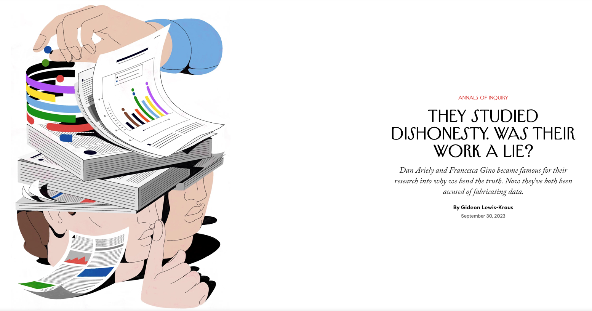
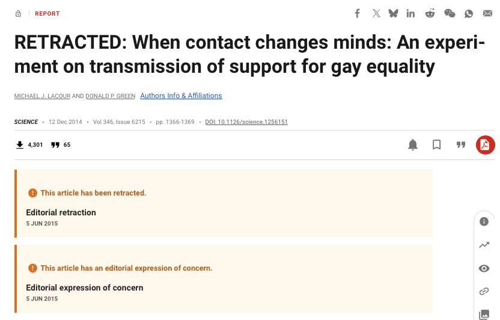
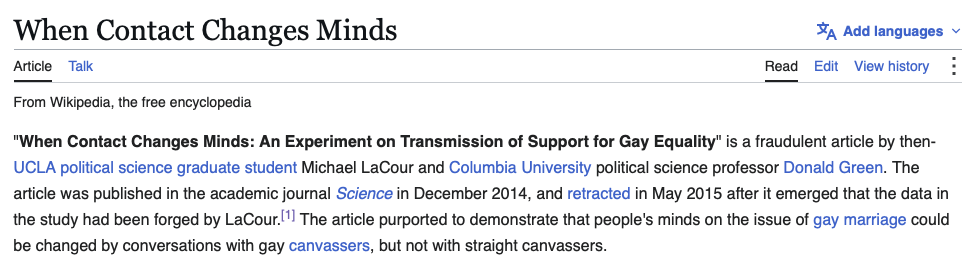
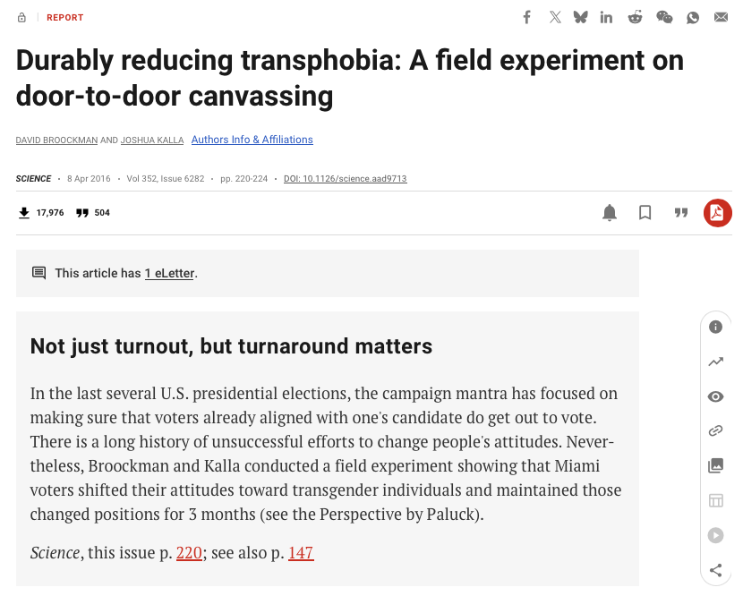
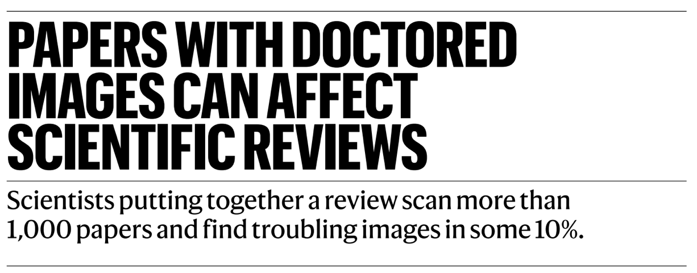
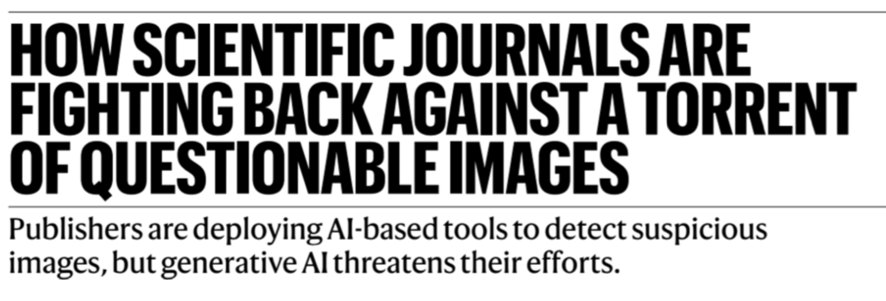
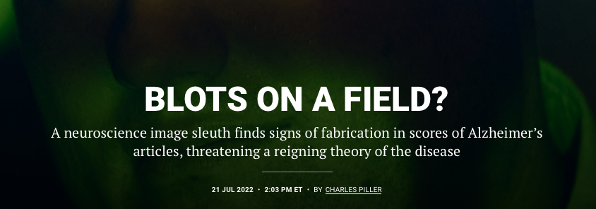
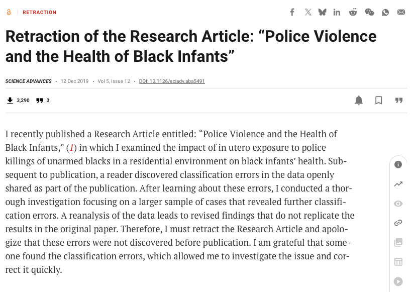
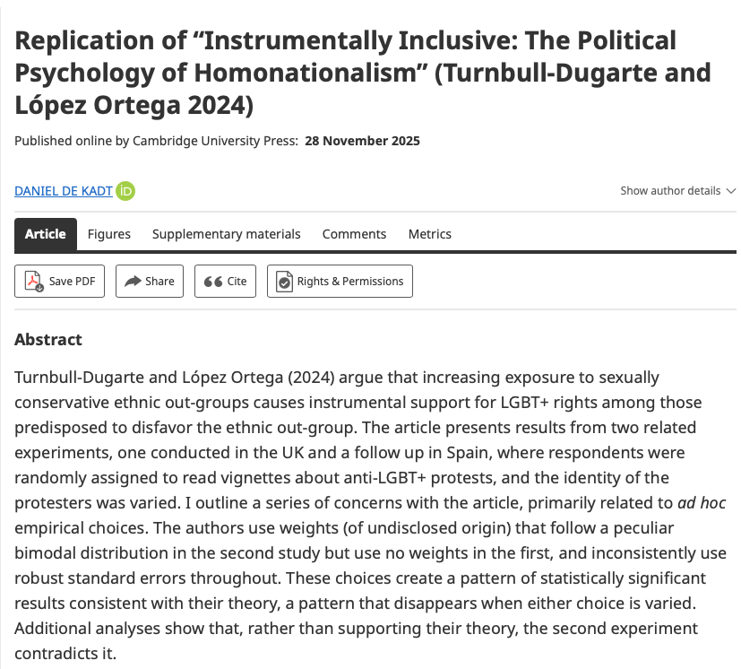
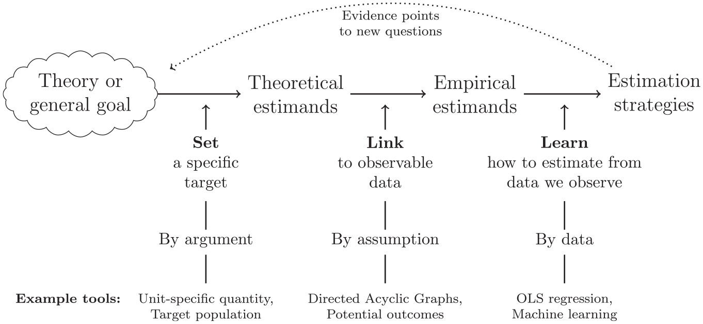

## `The problem`

 

:::{.r-stack}

{.fragment}

{.fragment .center width="750"}

{.fragment}

{.fragment}

{.fragment}

{.fragment}

{.fragment}

:::

. . .

Fraud is probably the fastest way to a press cover ... and even your own Wikipedia page!

## `But it's mostly not fraud`

 

:::{.r-stack}

{.fragment .center width="750"}

{.fragment}

:::

. . . 

Honest mistakes are possible, and so are theoretical and methodological disagreements 

## `A roadmap`

{fig-align="center" width=70%}

## `Course outline`

 

We aim to develop a research workflow that makes reproducibility feels natural and promotes conceptual clarity about the questions we ask, the route we take, and the answers we find

. . .

* [`Show how you do it`: Using Quarto and R]{.fragment .fade-in}

* [`Track while you do it`: Using Git and GitHub]{.fragment .fade-in}

* [`Say what you do`: Using (causal) diagrams]{.fragment .fade-in}

* [`Do what you say`: Using robust and flexible approaches]{.fragment .fade-in}
* [`Doubt what you do`: Using sensitivity analysis]{.fragment .fade-in}

* [`Did we even do it?` On the uses of AI-agents]{.fragment .fade-in}

. . .

`Course assessment:` Assessment is conducted through a replication project consisting of three parts. The paper should be between 6,000 and 8,000 words and of a standard appropriate for submission to an academic journal (Part 1). This is complemented by a research diary (Part 2) and replication code written in any statistical software (Part 3). The submission deadline is noon on Monday of Week 5 of Hilary Term.

